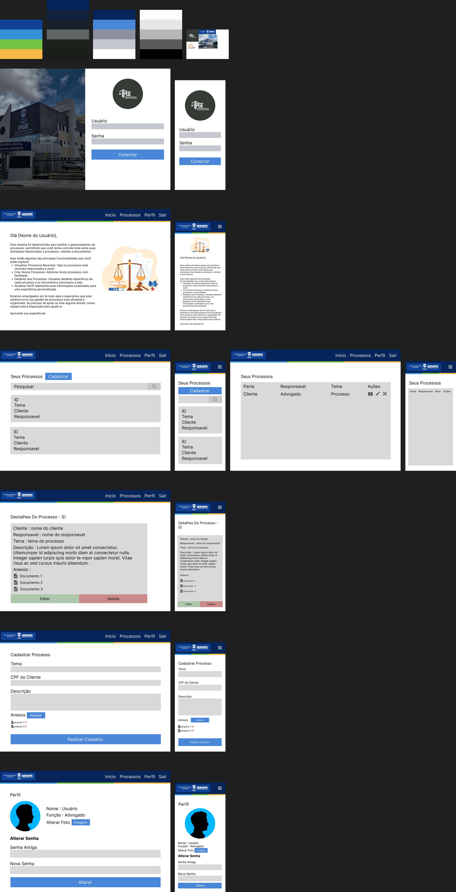

<p align="center">
    
</p>

<h1>Teste Pratico</h1>

> [!TIP]
> Seja bem-vindo ao projeto. Tendo como ponto de partida um PDF com instruções e requisitos que deveriam ser mantidos, desenvolvi esta solução. Este arquivo README contém uma documentação sobre a forma como o projeto foi desenvolvido, planejado e algumas dicas para localização dentro das pastas e arquivos. Sinta-se à vontade para se aventurar nesse projeto. Fico grato.
> 
> ##### Link Rápido
> Para explorar rapidamente, utilize o campo de seções, que dispõe de diversos links que redirecionam para os respectivos assuntos.
> 
>

<hr>

<h2>Vídeo Demonstrativo (Funcionamento)</h2>

https://github.com/wesleymacedodev/PGE/assets/123600728/cbf021af-ae73-4220-a046-4b30a4fd9480

https://github.com/wesleymacedodev/PGE/assets/123600728/4ff4721d-0cca-401f-a617-f89415369be0

<h2>Seções (Links Rápidos)</h2>
<ul>
 <li>
    <a href="#diagrama">Diagrama</a>
 </li>
 <li>
    <a href="#instalacao">Instalação</a>
 <li>
    <a href="#frontend">Frontend</a>
 </li>
  <li>
    <a href="#frontend">Backend</a>
 </li>
  <li>
    <a href="#banco">Banco</a>
 </li>
</ul>

<h2 id="diagrama">Diagrama</h2>

<h5>Criação Do DER</h5>
<span>Ferramenta : Draw.io</span>

<span>Site : https://app.diagrams.net</span>

> <b>Considerações</b>
> O diagrama foi desenvolvido durante o planejamento do banco de dados, com a inclusão da tabela `Login` para incorporar o sistema de autenticação. A estrutura foi totalmente desenvolvida de acordo com os requisitos solicitados com pequenas modificações.

<details>
    <summary>Imagem</summary>
    
</details>

<h5>Prototipagem Do Site</h5>
<span>Ferramenta : Figma</span>

<span>Site : https://www.figma.com</span><br>
<span>Prototipo : https://www.figma.com/design/lzmbasiMZi5VNsu4Hmtku0</span>

> <b>Considerações</b>
> A prototipagem foi feita logo no início do projeto, com o intuito de definir quais páginas seriam desenvolvidas e com a finalidade de estabelecer um estilo padrão, com um menu mais minimalista/simplista. Ao longo do desenvolvimento, ocorreram algumas pequenas modificações apenas para implementar algumas funcionalidades ou aperfeiçoar o layout.

<details>
    <summary>Imagem</summary>
    
</details>

<h2 id="instalacao">Instalação</h2>

<h5>Ambiente Da Aplicação</h5>
<ul>
    <li>
        <a href="https://dotnet.microsoft.com/pt-br/download/dotnet/8.0" target="_blank">Net SDK v8.0.3</a>
    </li>
    <li>
        <a href="https://nodejs.org/en/download/package-manager" target="_blank">Node.js v20.13</a>
    </li>
    <li>
        NPM v10.8.0
    </li>
</ul>

<h5>Ferramentas Utilizadas</h5>
<ul>
    <li>
        <a href="https://code.visualstudio.com" target="_blank">Visual Studio Code</a>
        <ul>
            <span>Extensões</span>
            <li>
               <a href="https://marketplace.visualstudio.com/items?itemName=Vue.volar" target="_blank">Vue - Oficial</a>
            </li>
            <li>
               <a href="https://marketplace.visualstudio.com/items?itemName=esbenp.prettier-vscode" target="_blank">Prettier</a>
            </li>
            <li>
               <a href="https://marketplace.visualstudio.com/items?itemName=dbaeumer.vscode-eslint" target="_blank">Eslint</a>
            </li>
        </ul>
    </li>
    <li>
        <a>Visual Studio 2022</a>
    </li>
</ul>

<h4>Como configurar e utilizar</h4>

<p>
Caso queira utilizar a aplicação da forma como foi desenvolvida, mantenha as configurações padrão. Neste projeto, as portas "5173" e "44372" estão em uso, e o diretório "C:\Uploads" está sendo utilizado para armazenar os anexos. Caso queira modificar, há instruções na aba configuração.
</p>

<span><b>Frontend - Etapas</b></span>

<details>
    <summary>Configuração</summary>
    <span><b>Alterar Porta Da Aplicação</b></span>

> Acessar arquivo `/Frontend/vue-project/vite.config.js`
> 
> Alterar campo : 
>
>  server: {
>    host: "0.0.0.0",
>    port: 5173 <b>(campo alvo)</b>
>  }


<span><b>Alterar Porta Da Api</b></span>

> Acessar arquivo `/Frontend/vue-project/src/services/http.js`
> 
> Alterar campo : 
>
>   {
>    baseURL: "https://localhost:44372/api", <b>(Campo alvo)</b>
>    headers: {
>        "Content-type": "application/json"
>       }
>   }

    
</details>

<details>
    <summary>Executar</summary>
<span>Entrar no diretorio</span>

```shell
cd Frontend/vue-project
```

<span>Instalar Dependências</span>

```shell
npm i
```

<span>Iniciar Projeto</span>

```shell
npm run dev
```
</details>

<br>

<span><b>Backend - Etapas</b></span>

<details>
    <summary>Configuração</summary>
    <span><b>Alterar Configurações Da Api</b></span>

> Acessar arquivo `/Backend/PGE/src/appsettings.json`
> 
```json
{
  "Logging": {
    "LogLevel": {
      "Default": "Information",
      "Microsoft.AspNetCore": "Warning"
    }
  },
  "FileSettings": {
    "FilePath": "C:\\Uploads"
  },
  "Settings": {
    "SqlConnectionString": "Server=DESKTOP-HROQSP2\\SQLEXPRESS;Database=PGE;User Id=user;Password=user;TrustServerCertificate=True",
    "CORSorigin": "http://localhost:5173",
    "JWTIssuer": "localhost",
    "JWTAudience": "http://localhost",
    "JWTIssuerKey": "chave_secreta_3129308123#!@#!#sdasd"
  },
  "AllowedHosts": "*"
}

```
> Configurações
>
> <b>FileSettings:FilePath</b>
> Configuração do caminho que os anexos vão ser salvos.
>
> <b>Settings:SqlConnectionString</b>
> Link de conexão com o banco de dados
>
> <b>Settings:CORSorigin</b>
> Configuração do cors para aceitar requisições no site.
>
> <b>Settings:JWTIssuer</b>
> Quem está destinando
>
> <b>Settings:JWTAudience</b>
> Para quem vai ser destinado 
>
> <b>Settings:JWTIssuerKey</b>
> Chave de segurança para a autenticação JWT

</details>

<details>
    <summary>Executar</summary>
    <span>Instalar Dependências</span>

```shell
dotnet restore
```

<span>Iniciar Projeto</span>

```shell
dotnet run --urls=https://localhost:44372/
```
</details>


<h2 id="frontend">Frontend</h2>

<h5>Estrutura De Arquivos</h5>

<details>
<summary>/public/</summary>
<span>Função : responsável pelos arquivos publicos.<span>
</details>

<details>
<summary>/src/</summary>
<span>Função : responsável pelos principais arquivos.<span>
</details>

<details>
<summary>/src/assets</summary>
<span>Função : responsável pelo armazenamentos dos arquivos e imagens utilizados no site.<span>
</details>

<details>
<summary>/src/components</summary>
<span>Função : responsável por armazenar as estruturas/componentes que possam ser reutilizados em outra parte do projeto.<span>
</details>

<details>
<summary>/src/components/icons</summary>
<span>Função : responsável pelo armazenamento dos componentes de icones para serem utilizados durante a elaboração do projeto.<span>
</details>

<details>
<summary>/src/services</summary>
<span>Função : responsável pelos arquivos que auxiliarão na hora de autenticação e utilização das requisições.<span>
</details>

<details>
<summary>/src/views</summary>
<span>Função : responsável pelo armazenamentos das páginas presentes no projeto.</span>
</details>

<details>
<summary>/src/router</summary>
<span>Função : responsável pelo armazenamento de arquivos para o gerenciamento das rotas do site.</span>
</details>

<h5>Rotas Da Página</h5>

<details>
<summary>/ - Página Inicial </summary>
<p>Tela inicial, onde recepciona o usuário com um bem-vindo e demonstra algumas funcionalidades básicas do site.</p>
</details>

<details>
<summary>/profile - Perfil</summary>
<p>
Tela de perfil, permite que o usuário veja algumas informações básicas sobre ele e faça a alteração da senha de login.
</p>
</details>

<details>
<summary>/login - Login De Usuário</summary>
<p>
Tela de login, responsável por autenticar e autorizar o acesso do usuário ao sistema.
</p>
</details>

<details>
<summary>/process/:id - Visualizar Processo</summary>
<p>
Tela de visualização de processo, mostra as informações do processo, permitindo que o usuário faça alterações caso seja necessário.
</p>
</details>

<details>
<summary>/process/search - Pesquisar Processo</summary>
<p>
Tela de busca de processo, permite que você navegue e pesquise processos relacionados a você ou outros advogados através da utilização do número de processo.
</p>
</details>

<details>
<summary>/process/register - Registrar Processo</summary>
<p>Tela de registro do processo, permite que você registre um novo processo caso seja advogado e adicione um cliente alvo do processo, contendo todas as informações referentes ao processo.</p>
</details>

<details>
<summary>/process/edit/:id - Editar Processo</summary>
<p>Tela de edição do processo, permite que você faça alterações nos processos existentes que pertençam a você, além de permitir o anexo de arquivos ao processo.</p>
</details>

<h2 id="backend">Backend</h2>

<h5>Estrutura De Arquivos</h5>

<details>
<summary>/Controllers</summary>
<span>Função : Responsável por manipular os endpoints da aplicação com a atribuição dos métodos.</span>
</details>
<details>
<summary>/DTOs</summary>
<span>Função : responsável por armazenar todas as propriedades e especificidades de uma tabela.</span>
</details>
<details>
<summary>/Interfaces</summary>
<span>Função : Responsável por garantir que as funcionalidades dos models estejam no contexto da aplicação e sejam incluídas.</span>
</details>
<details>
<summary>/Mappings</summary>
<span>Função : Responsável pelo mapeamento das entidades e dos elementos DTO</span>
</details>
<details>
<summary>/Models</summary>
<span>Função : Responsável pelos modelos de entradas e saídas de informação, além de abranger o contexto do banco de dados.
</span>
</details>
<details>
<summary>/Repositories</summary>
<span>Função : Responsável pelos metodos CRUD básicos, manipulando o contexto do banco de dados.</span>
</details>

<details>
<summary>/Services</summary>
<span>Função : Responsável pelo gerenciamento de serviços, tendo presente o arquivo que fornece a autenticação.</span>
</details>

<br>

> <span><b>appsettings.json</b></span>
> arquivo de configuração 

<h5>Endpoints</h5>

<span>Swagger</span>
<span>https://localhost:44372/swagger/index.html</span>
<details>
    <summary>Login</summary>

<details>
<summary>/api/Login/Validade - GET</summary>

> Tem como principal finalidade validar se o token do usuário é valido ou não.
</details>

<details>
<summary>/api/Login - POST</summary>

> Verifica as informações de login, caso sejam válidas, o usuário receberá o token de autenticação.
</details>

<details>
<summary>/api/Login/Register - POST</summary>

> Cadastra um novo login ao sistema, definindo qual o usuário que vai ser pertencente. 
</details>

<details>
<summary>/api/Login/ChangePassword - POST</summary>

> Redefine a senha do usuário, apenas necessitando da antiga senha e a nova.
</details>

</details>

<br>

<details>
    <summary>Pessoa</summary>

<details>
<summary>/api/Pessoa - GET</summary>

> Puxa todas as pessoas cadastradas no sistema, esta rota só é acessível para quem tem permissão de admin.
</details>

<details>
<summary>/api/Pessoa/Info - GET</summary>

> Puxa as informações do usuário que está chamando essa rota, retornando um json com seus dados.
</details>

<details>
<summary>/api/Pessoa/{id} - GET</summary>

> Puxa as informações de um usuário específico; esta rota é apenas acessível para quem tem permissão de admin.
</details>

<details>
<summary>/api/Pessoa - POST</summary>

> Adiciona uma nova pessoa ao sistema, esta função está apenas acessível para quem tem permissão de admin.
</details>

<details>
<summary>/api/Pessoa - PUT</summary>

> Edita as informações de uma nova pessoa ao sistema, esta função está apenas acessível para quem tem permissão de admin.
</details>

<details>
<summary>/api/Pessoa/{id} - Delete</summary>

> Deleta a pessoa do sistema, esta função está apenas acessível para quem tem permissão de admin.
</details>

</details>

<br>

<details>
    <summary>Processo</summary>

<details>
<summary>/api/Processo - GET</summary>

> Puxa todos os processos do sistema, esta função está apenas acessível para quem tem permissão de admin.
</details>

<details>
<summary>/api/Processo/List - GET</summary>

> Puxa todos os processos pertencentes ao usuário, caso seja advogado, retorna os processos de outros advogados também.
</details>

<details>
<summary>/api/Processo/{id} - GET</summary>

> Puxa as informações de um processo especifico pelo id.
</details>

<details>
<summary>/api/Processo - POST</summary>

> Cadastra um novo processo ao sistema, porém tem a necessidade do usuário ser um advodago (ter um código oab).
</details>

<details>
<summary>/api/Processo - PUT</summary>

> Altera informações do processo, porém há a verificação se o usuário realmente é responsável pelo processo (é o advogado proprietário).
</details>

<details>
<summary>/api/Processo/{id} - DELETE</summary>

> Deleta o processo do sistema, verificando se realmente é o dono do processo (responsável) que está efetuando a ação.
</details>

</details>

<br>

<details>
    <summary>Documento</summary>

<details>
<summary>/api/Documento - GET</summary>

> Puxa todos os documentos do sistema, esta função está apenas acessível para quem tem permissão de admin.
</details>

<details>
<summary>/api/Documento/{id} - GET</summary>

> Retorna a informação de um arquivo especifico do sistema, esta função está apenas acessível para quem tem permissão de admin.
</details>

<details>
<summary>/api/Documento/Download/{id} - GET</summary>

> Retorna o anexo do documento em arquivo, verificando se o usuário é o cliente ou advogado.
</details>

<details>
<summary>/api/Documento/Processo/{id} - GET</summary>

> Retorna todos as informações dos documentos pertecentes a um processo.
</details>

<details>
<summary>/api/Documento - POST</summary>

> Adiciona um novo anexo ao sistema e registra como documento, além de verificar se o usuário que está executando o upload é pertecente ao processo.
</details>

<details>
<summary>/api/Documento - PUT</summary>

> Modifica as informações especificas de um documento do sistema, esta função está apenas acessível para quem tem permissão de admin.
</details>

<details>
<summary>/api/Documento/{id} - DELETE</summary>

> Deleta o anexo e o documento do sistema, essa função só pode ser executada pelo usuário proprietário ou pertencente ao processo.
</details>

</details>

<br>

<details>
    <summary>Distribuir</summary>

<details>
<summary>/api/Distribuir - GET</summary>

> Puxa todas as distribuições do sistema, esta função está apenas acessível para quem tem permissão de admin.
</details>

<details>
<summary>/api/Distribuir/{id} - GET</summary>

> Puxa uma distribuição especifica pelo id no sistema, esta função está apenas acessível para quem tem permissão de admin.
</details>

<details>
<summary>/api/Distribuir - POST</summary>

> Adiciona uma nova distribuição no sistema e executa a alteração do responsável do processo, além de salvar o estado do antigo responsável e o novo.
</details>

<details>
<summary>/api/Distribuir - PUT</summary>

> Altera as informações de uma distribuição especifica pelo id no sistema, esta função está apenas acessível para quem tem permissão de admin.
</details>

<details>
<summary>/api/Distribuir/{id} - DELETE</summary>

> Deleta uma distribuição especifica pelo id no sistema, esta função está apenas acessível para quem tem permissão de admin.
</details>

</details>

<h2 id="banco">Banco</h2>
<br>
<span>Sql Server 2022 - Express</span>
<details>
<summary>Criar Banco De Dados (DDL)</summary>

```sql
CREATE DATABASE [PGE];
GO 

USE [PGE]
GO

CREATE TABLE Pessoa (
    id INT IDENTITY(1,1),
    nome VARCHAR(255) NOT NULL,
    cpf VARCHAR(11) NOT NULL,
    oab VARCHAR(20)
	CONSTRAINT PK_Pessoa PRIMARY KEY (id),
	CONSTRAINT UQ_Pessoa_CPF UNIQUE (cpf)
);

CREATE TABLE Login (
	id INT IDENTITY(1,1),
	pessoa_id INT NOT NULL, 
	nome VARCHAR(255) NOT NULL,
	password_hash varbinary(MAX) NOT NULL,
	password_salt varbinary(MAX) NOT NULL,
	admin BIT DEFAULT 0,
	CONSTRAINT FK_Login_Pessoa FOREIGN KEY (pessoa_id) REFERENCES Pessoa(id),
	CONSTRAINT PK_Login PRIMARY KEY (id),
	CONSTRAINT UQ_Login_Pessoa UNIQUE (pessoa_id),
	CONSTRAINT UQ_Login_Nome UNIQUE (nome)
);

CREATE TABLE Processo (
    id INT IDENTITY(1,1),
    numero_processo INT NOT NULL,
    parte_id INT NOT NULL,
    responsavel_id INT NOT NULL,
    tema VARCHAR(255) NOT NULL,
	descricao VARCHAR(255),
    valor DECIMAL(15, 2),
    CONSTRAINT FK_Processo_Parte_Pessoa FOREIGN KEY (parte_id) REFERENCES Pessoa(id),
	CONSTRAINT FK_Processo_Responsavel_Pessoa FOREIGN KEY (responsavel_id) REFERENCES Pessoa(id),
	CONSTRAINT PK_Processo PRIMARY KEY (id),
	CONSTRAINT UQ_Processo_Numero_Processo UNIQUE (numero_processo)
);

CREATE TABLE Documento (
    id INT IDENTITY(1,1),
    nome VARCHAR(255) NOT NULL,
    caminho VARCHAR(255) NOT NULL,
    extensao VARCHAR(10) NOT NULL,
    processo_id INT NOT NULL,
    CONSTRAINT FK_Documento_Processo FOREIGN KEY (processo_id) REFERENCES Processo(id),
	CONSTRAINT PK_Documento PRIMARY KEY (id)
);

CREATE TABLE Distribuir (
    id INT IDENTITY(1,1),
    processo_id INT NOT NULL,
    responsavel_antigo_id INT NOT NULL,
    responsavel_novo_id INT NOT NULL,
    data DATE DEFAULT GETDATE(),
    CONSTRAINT FK_Distribuir_Processo FOREIGN KEY (processo_id) REFERENCES Processo(id),
    CONSTRAINT FK_Distribuir_Antigo_Pessoa FOREIGN KEY (responsavel_antigo_id) REFERENCES Pessoa(id),
    CONSTRAINT FK_Distribuir_Nova_Pessoa FOREIGN KEY (responsavel_novo_id) REFERENCES Pessoa(id),
	CONSTRAINT PK_Distribuir PRIMARY KEY (id)
);
```
</details>

<details>
<summary>Popular Banco De Dados (DML)</summary>

```sql 
-- Inserir Pessoas

INSERT INTO Pessoa (nome, cpf, oab) VALUES ('João Silva', '12345678901', NULL); 
INSERT INTO Pessoa (nome, cpf, oab) VALUES ('Maria Oliveira', '23456789012', 'OAB12345'); 
INSERT INTO Pessoa (nome, cpf, oab) VALUES ('Carlos Santos', '34567890123', NULL); 
INSERT INTO Pessoa (nome, cpf, oab) VALUES ('Ana Paula', '45678901234', 'OAB54321'); 
INSERT INTO Pessoa (nome, cpf, oab) VALUES ('Lucas Pereira', '56789012345', NULL); 

-- Inserir Login (nome:senha)

-- joao:joao
INSERT INTO Login (pessoa_id, nome, password_hash, password_salt) VALUES (1, 'joao', 0xE875E4FD8362E2470CA8957C1CFECFDCCEA5D9ACD7AE64E810A09A968783713EA185452291BA51F19A40E1F87EF30002CEFA3061D2F626525F59F10D17609EF2, 0x8DD64079F6FB2508DA05876C05BDE0BAE48B62394B482FA24EDF329D45046BF2114F220317A444EE9241D6E54E33B86C431389F2F1E29F5F2EB5FBBE040B279085DEF2AC17083AEAE0C6133BA19BE21274CC9C89FCBB46228D5748600BE6C4D34BD6F294B763CAC27A4B881126A006C152308E715D52C228949B0503B1E06CFF);
-- maria:maria
INSERT INTO Login (pessoa_id, nome, password_hash, password_salt) VALUES (2, 'maria', 0xC6FE7BAB6582C31DBD22FCBB43BB039D937F97A6B6E9906BC09522C8C3F3A97B8A769C79FC2B79B67FA93856083A6BD8C8E6D5DE183F510F6754EDC0158160A7, 0xDD3EAE07B316B1F8C6B29F8DF1479683498358AF83BB3C7E220172AD47910566F4FD84193DFD3A27B13B89926D5DBED2E19A588A915048FA62C670A58EA7DD25B4F27B9258A171B3BAD9FFC57B0FB88D7FE4A74A85C865CE446D2EE9D630C84FE42C894DC07731F0A79A986E5353E723D4FCCC2E41D4F8AE22FCE2720AD79FD0);
-- carlos:carlos
INSERT INTO Login (pessoa_id, nome, password_hash, password_salt) VALUES (3, 'carlos', 0x269592401A733C657B6B59D9719EF732975CA5CA07E48CED44592C1EAAF986B0355CA75946B726E4F814D56EE6A8F0352C0CAAA59111EE46908D04C6E45379BC, 0xF6B55F083E3525C619C323062FD1BF81794F9A5117A57E12EBD8DD922F3738BB1D87BFA05B9A8130CF689F7E22CAEB603884A0500F1D5C91C14BC39AC53203E817D1204CCF6C1499EC9CA05B614D09831FCEEFEA416061A53C9836320593C5FF631965B3956F27AAF404866704FCA1FAB2C620EBF4B14A1C6AE7038A83B35820);
-- ana:ana (permissão de admin)
INSERT INTO Login (pessoa_id, nome, password_hash, password_salt, admin) VALUES (4, 'ana', 0x8E436DF4F75CDAC326EEA5764D0EF2D5C0C1C639A8C955304CCAB2B065569222C33740A3AE1D4D082A61FEC99BA7ED90EA843A4C21592CF2B4600433D7227257, 0x8427C8D9726A725E601F077A08A0311C8AD7EF96D2785E1737C29AF401CEEE8FA7729A24CF4495A127823EBAD6FBD05EE28CC04E1C060601F6B6B1931E2A78553C6E7609E65004EA8DC44852050C6A41442369E674DDD1005565FA6D442E07A8659D46C3D9AE56A8760488F8865BE07F5DA58F7E60A833AB1DB619A54BD3C19D, 1);
-- lucas:ucas
INSERT INTO Login (pessoa_id, nome, password_hash, password_salt) VALUES (5, 'lucas', 0x96AB305DE5D70C806A479A9151761D8B92DDA7FFD464060268FD3670546A2E248AF53AE08D916B70D7AD8BB14B4490275FD73ACC77EBA7B9DBED1B88580558AD, 0x7B6C192A36FBE64E8A727526DD23D46FE2B67D7C77B2E019BFCE0F4B2E674DD4C099C75CA03138AFBCC9187B1A7FE10340838D7442C96EA1D01E4100842A12AF3C4BDB6FB536C77E9C655B03089336F373CFB2B8FD8A1FF5F1FD4FB7F8799AA4F2B1B8D177F0B7A92B73766283ADC1B8213739B2BD2A5B2B8C6957338AFD742B);

-- Inserir Processos

INSERT INTO Processo (numero_processo, parte_id, responsavel_id, tema, descricao, valor) VALUES (12345, 1, 2, 'Divórcio', 'Processo de divórcio consensual', 5000.00);
INSERT INTO Processo (numero_processo, parte_id, responsavel_id, tema, descricao, valor) VALUES (67890, 1, 2, 'Ação Trabalhista', 'Reclamação trabalhista por horas extras', 15000.00);
INSERT INTO Processo (numero_processo, parte_id, responsavel_id, tema, descricao, valor) VALUES (93128, 3, 2, 'Ação Trabalhista', 'Reclamação trabalhista por horas extras', 20000.00);
INSERT INTO Processo (numero_processo, parte_id, responsavel_id, tema, descricao, valor) VALUES (11223, 1, 4, 'Ação de Cobrança', 'Cobrança de dívida não paga', 8000.00);
INSERT INTO Processo (numero_processo, parte_id, responsavel_id, tema, descricao, valor) VALUES (39283, 5, 4, 'Ação de Cobrança', 'Cobrança de dívida não paga', 10000.00);
```
</details>

</table>


